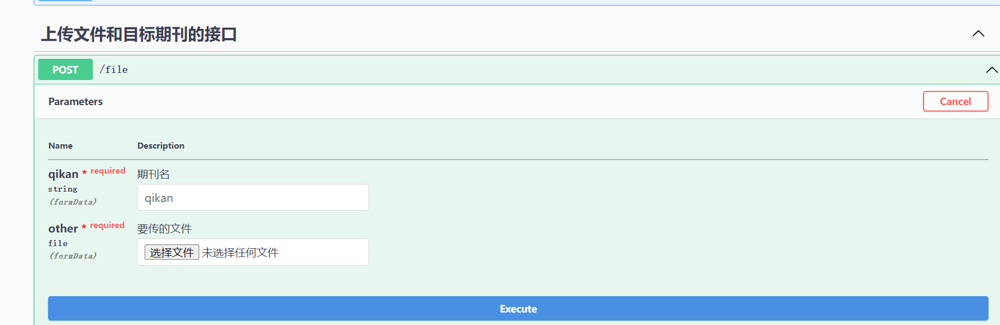

# 知网引文爬虫web系统

#### 项目简介
为了实现引文爬取自动化，以满足科研任务需求，由此开发一个web系统方便使用。

#### 技术栈
服务器端: Gin + Gorm + swagger
爬虫: selenium + htmlquery

#### 使用说明
配置好环境后
登入http://localhost:8080/swagger/index.html,打开Post的下拉框

期刊名是要收集的期刊
要传的文件是url集合的txt文件
完成后execute发送,后台就会开始爬虫
#### 例子展示

#### 程序架构图

